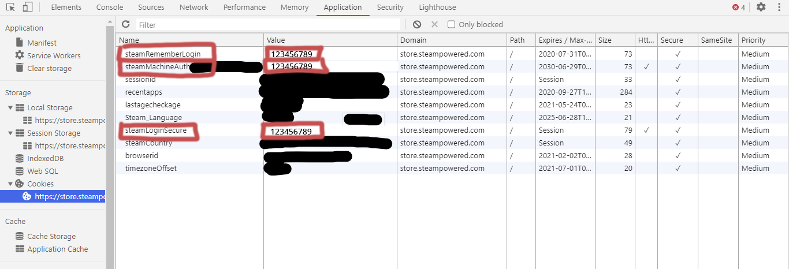
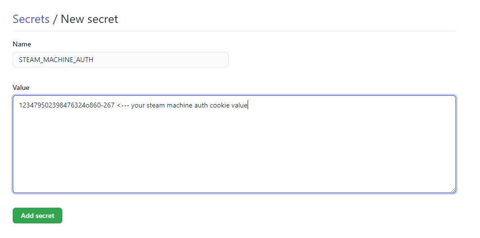

# Steam Queue Bot

A work in progress python script that can be used with github actions to automatically clear your steam queue, so that you can get your free trading cards during a sale event. 

## Status

I'm still in the process of testing this script and I'm not even sure if its working at all yet because I keep accidentally clearing my queue :(

On top of that I don't know how robust the method of using steam cookies for authentication is. According to https://dev.doctormckay.com/topic/365-cookies/ cookies can expire for many reasons. But my hope is that they will be able to last for the short time steam sales last. So a possibility is the script might end up working -  but only for a day.

## Dependencies

Python 3.7

## Instructions

1. Go to https://store.steampowered.com/ in your browser and log in to steam
2. Press F-12 to open up the developer tools of your browser
3. If you're in chrome go to the Application tab, then cookies for store.steampowered.com
4. Copy the `value` for the following cookies:
    - `steamRemeberLogin`
    - `steamMachineAuth`
    - `steamLoginSecure`
    
    

You can now either run the script _locally_ or as a _github action_.

**Locally:**

5. Open [queue-bot.py](queue-bot.py). 
6. Replace each `os.getenv()` at the bottom with the value of the cookie you just copied, so `os.getenv("STEAM_REMEMBER_LOGIN")` would turn into `38579248u572989` or whatever the value of the steamRemeberLogin cookie is. This should leave you with a line that looks something like this:
    ```python
    queue = SteamQueue(
        "345789348924623456dgjhy",
        "357257dfh34t6245734738",
        "489276fhjksuiog76q984t6ht",
    )
    ```
7. Run the script with `python queue-bot.py`

---

**Github Actions:**

The script comes with a github action that is scheduled to run once a day automatically. To set this up you need to:

5. Fork this repo to your own github account
6. In the forked repo open the github repo settings, then go to Secrets
7. Create a new secret for each of the cookies you copied with the following names:
    - `STEAM_MACHINE_AUTH`
    - `STEAM_REMEMBER_LOGIN`
    - `STEAM_LOGIN_SECURE`
    
8. The script should now automatically run once a day, be sure to disable the action when the sale is over
 